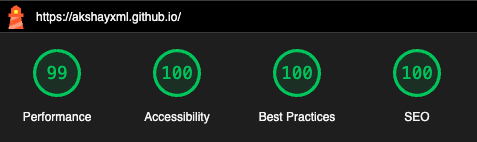

# Portfolio Website

Welcome to my personal portfolio project! This portfolio showcases my projects, work experiences, and links to my social handles. Built using Gatsby, it serves as both a digital resume and a collection of my work.

## Features
- Responsive Design: Optimized for all device sizes.
- Interactive UI: Engaging and user-friendly interface.
- Projects Section: Displays various projects with details and links.
- Work Experience Section: Highlights my current and previous work experiences.
- Social Handles: Links to my social handles
- Light and Dark mode support
- Google Analytics
- Lightning Fast  :zap: , even with Google Tag Manager : Lighthouse and PageSpeed Passed
 

## Technologies
- Frontend: React, Gatsby
- Styling: CSS, Sass
- Hosting: GitHub Pages
- Analytics: Google Analytics, Google Tag Manager

**Check It Out!** :rocket:
<a href="https://akshayxml.github.io" target="_blank">akshayxml.github.io</a>